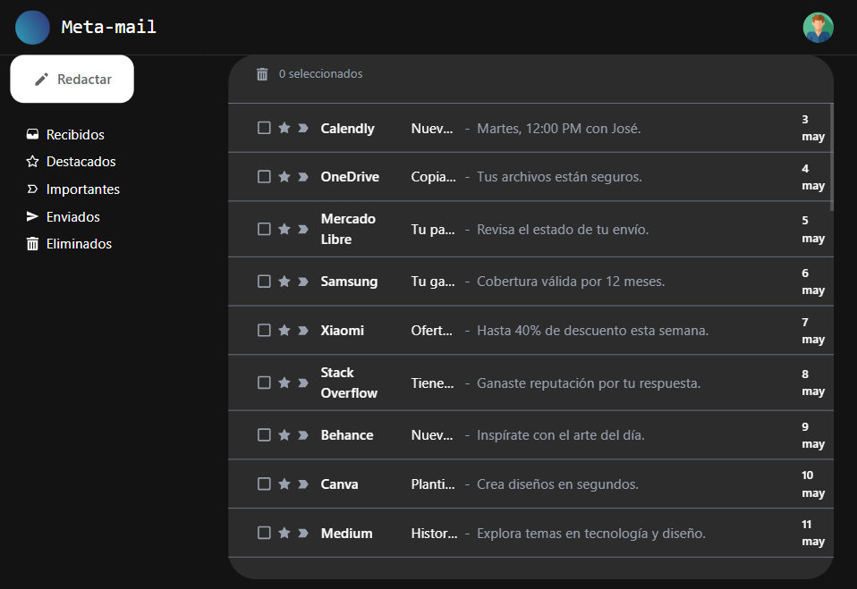

# Gestor de Correos con IA

Link del proyecto: [https://gmail-git-main-joseluis-projects-796920dc.vercel.app/](https://gmail-git-main-joseluis-projects-796920dc.vercel.app/)

Basado en la interfaz de Gmail, desarrollé una aplicación web que permite **crear, eliminar, gestionar y responder correos electrónicos**. Entre sus principales características se incluyen:



Selección múltiple de correos


Eliminación de correos con traslado automático a la pestaña "Eliminados”


Marcado de correos como importantes o destacados


Redacción de correos mediante un modal, los cuales se almacenan en la pestaña "Enviados”


Además, integré **inteligencia artificial usando el modelo de lenguaje de OpenAI** para generar respuestas automáticas a los correos recibidos.


## Pasos que seguí para desarrollar y desplegar la app

### 1. **Configuración del Proyecto**

- Inicialicé un nuevo proyecto con `Vite + React`.
- Instalé dependencias esenciales:
  ```bash
  npm create vite@latest
  npm install react-router-dom zustand tailwindcss openai
  ```

### 2. **Diseño de la Interfaz**

- Usé **Tailwind CSS** para estilizar los componentes.
- Dividí la aplicación en vistas: **Bandeja de Entrada**, **Eliminados**, **Enviados**, etc.
- Implementé navegación con **React Router**.

### 3. **Lógica y Estado**

- Manejo del estado global con **Zustand** para mantener una estructura sencilla y modular.
- Agregué funcionalidades como:
  - Marcar correos como importantes
  - Eliminar correos (traslado automático a “Eliminados”)
  - Redacción de correos desde un modal

### 4. **Integración de la IA (OpenAI)**

- Usé la API de **OpenAI (GPT-4.1)** para generar respuestas automáticas.
- Al hacer clic en un botón, el sistema genera una respuesta sugerida al correo seleccionado.
  Ejemplo de integración:

  ```jsx
  import OpenAI from "openai";
  const client = new OpenAI();

  const response = await client.responses.create({
    model: "gpt-4.1",
    input:
      "Escribe una respuesta breve a un correo sobre una reunión cancelada.",
  });

  console.log(response.output_text);
  ```

### 5. **Deploy en Vercel**

- Subí el proyecto a GitHub.
- Lo conecté a **Vercel** y lo desplegué directamente desde el repositorio.
- Configuré las variables de entorno necesarias (API Key de OpenAI).

---

## Tecnologías Utilizadas

- **Frontend:** React + Vite
- **Estilos:** Tailwind CSS
- **Estado global:** Zustand
- **Routing:** React Router
- **IA:** OpenAI API (GPT-4.1)
- **Deploy:** Vercel
